# DNS Setup Guide for Incus/LXD Infrastructure on macOS

## DNS Fundamentals

Before diving into our custom DNS setup, it's essential to understand how DNS works. This knowledge will help you make informed decisions about your infrastructure and troubleshoot issues effectively.

### What is DNS?

**DNS (Domain Name System)** is often called "the phonebook of the internet." It's a distributed database system that translates human-readable domain names (like `google.com` or `web-server.homelab.local`) into IP addresses (like `192.168.1.101`) that computers use to communicate.

**Why DNS is Essential:**
- **Human-Friendly**: We remember names better than numbers
- **Flexibility**: IP addresses can change without affecting the domain name
- **Load Distribution**: One domain can point to multiple IP addresses
- **Service Location**: Different services can have different subdomains

Without DNS, you'd need to remember that Google is at `172.217.14.142`, Facebook is at `157.240.11.35`, and your home web server is at `192.168.1.101`. Imagine managing hundreds of services this way!

### DNS Hierarchy and Infrastructure


### DNS Resolution Process Overview

When you type `web-server.homelab.local` in your browser, here's what happens behind the scenes:


### How DNS Resolution Works - Step by Step

Let's break down what happens when you want to access `web-server.homelab.local`:

#### Phase 1: Local Cache Check
1. **Browser Cache**: Your browser first checks its own DNS cache
2. **OS Cache**: If not found, the operating system checks its DNS cache
3. **Router Cache**: Some routers also maintain DNS caches

#### Phase 2: Recursive Resolver Query
If no local cache has the answer:
1. Your device sends the query to a **recursive resolver** (usually your ISP's DNS server or a custom one like our Pi-hole)
2. The recursive resolver acts as your "DNS agent" - it will do all the work to find the answer

#### Phase 3: The DNS Hierarchy Walk
The recursive resolver performs these steps:

1. **Root Server Query**:
   - Asks: "Who handles `.local` domains?"
   - Root server responds: "Ask the `.local` TLD servers"

2. **TLD Server Query**:
   - Asks `.local` TLD server: "Who handles `homelab.local`?"
   - TLD server responds: "Ask the authoritative server at 192.168.1.10"

3. **Authoritative Server Query**:
   - Asks your DNS server: "What's the IP for `web-server.homelab.local`?"
   - Your server responds: "192.168.1.101"

#### Phase 4: Response and Caching
1. The recursive resolver sends the IP back to your device
2. **Caching occurs at every level**:
   - Recursive resolver caches the answer
   - Your OS caches the answer
   - Your browser caches the answer
3. Future queries for the same domain will be much faster

### DNS Protocols and Components

#### Network Protocols
- **Port 53**: Standard DNS port (both UDP and TCP)
- **UDP**: Used for most DNS queries (faster, connectionless)
- **TCP**: Used for large responses or zone transfers (reliable, connection-based)

#### Key DNS Components

**1. Recursive Resolver (DNS Resolver)**
- Your "DNS agent" that does the work for you
- Examples: 8.8.8.8 (Google), 1.1.1.1 (Cloudflare), your ISP's DNS
- In our setup: **Pi-hole or dnsmasq** acts as a recursive resolver

**2. Authoritative Server**
- The "official source" for a domain's DNS records
- Stores the actual DNS records (A, AAAA, CNAME, MX, etc.)
- In our setup: **Your Pi-hole/dnsmasq server** is authoritative for `.homelab.local`

**3. Root Servers**
- 13 root server clusters worldwide (a.root-servers.net through m.root-servers.net)
- Top of the DNS hierarchy
- Direct queries to appropriate TLD servers

**4. TLD (Top-Level Domain) Servers**
- **What they are**: Servers that handle the "top level" of domain names - the part after the last dot
- **Examples of TLDs**: `.com`, `.org`, `.net`, `.edu`, `.gov`, `.local`, `.uk`, `.de`
- **Their job**: Know which authoritative servers handle specific domains within their TLD
- **How they work**: 
  - When asked about `google.com`, the `.com` TLD servers respond: "Ask Google's authoritative servers at these IP addresses"
  - When asked about `homelab.local`, the `.local` TLD servers would respond: "Ask the authoritative server at 192.168.1.10"
- **Real-world example**: Verisign operates the `.com` and `.net` TLD servers, handling billions of queries daily
- **In our setup**: For `.local` domains, your local network's DNS resolver (Pi-hole/dnsmasq) effectively acts as both the TLD server AND the authoritative server

### DNS Record Types - What They Are and Why We Need Them

**What are DNS Records?**
DNS records are like entries in a database that tell the DNS system how to respond to different types of queries. Think of them as instructions that say "when someone asks for X, give them Y."

**Why Do We Need Different Record Types?**
Different services and protocols need different types of information:
- Web browsers need IP addresses to connect to websites
- Email systems need to know which servers handle mail
- Load balancers need multiple IP addresses for the same service
- Network administrators need human-readable names for IP addresses

**How DNS Records Work:**
Each DNS record has three main parts:
1. **Name**: The domain name being queried (e.g., `web-server.homelab.local`)
2. **Type**: What kind of information is being requested (e.g., A, CNAME, MX)
3. **Value**: The answer to provide (e.g., an IP address, another domain name)

### Common DNS Record Types Explained

| Record Type | What It Does | Why You Need It | Example |
|------------|-------------|-----------------|---------|
| **A** | Maps domain to IPv4 address | Basic web access, most common record | `web-server.homelab.local → 192.168.1.101` |
| **AAAA** | Maps domain to IPv6 address | Future-proofing for IPv6 networks | `web-server.homelab.local → 2001:db8::101` |
| **CNAME** | Creates an alias to another domain | Friendly names, service redirection | `www.homelab.local → web-server.homelab.local` |
| **MX** | Specifies mail servers for a domain | Email delivery routing | `homelab.local → mail.homelab.local (priority 10)` |
| **PTR** | Reverse DNS (IP to domain name) | Security, logging, troubleshooting | `192.168.1.101 → web-server.homelab.local` |
| **TXT** | Stores arbitrary text information | Email security (SPF), domain verification | `"v=spf1 include:_spf.google.com ~all"` |
| **SRV** | Service location records | Service discovery, protocols like SIP | `_http._tcp.homelab.local → web-server.homelab.local:80` |
| **NS** | Name server records | Delegation to other DNS servers | `homelab.local → dns-server.homelab.local` |

### Real-World Examples in Your Homelab

**Scenario 1: Basic Web Server Access**
```
# A Record - Most basic and common
web-server.homelab.local.    A    192.168.1.101

# When you type "web-server.homelab.local" in browser:
# DNS returns IP 192.168.1.101, browser connects to that IP
```

**Scenario 2: User-Friendly Aliases**
```
# A Record - The actual server
web-server.homelab.local.     A        192.168.1.101

# CNAME Records - Friendly aliases
www.homelab.local.           CNAME    web-server.homelab.local.
blog.homelab.local.          CNAME    web-server.homelab.local.
site.homelab.local.          CNAME    web-server.homelab.local.

# All three names (www, blog, site) point to the same server
# Easy to remember, easy to change if server IP changes
```

**Scenario 3: Service Discovery**
```
# Different services on different servers
web.homelab.local.           A        192.168.1.101
api.homelab.local.           A        192.168.1.102  
database.homelab.local.      A        192.168.1.103
cache.homelab.local.         A        192.168.1.104

# Applications can automatically find services by name
# No hardcoded IP addresses in your application configs
```

**Scenario 4: Load Balancing with Multiple A Records**
```
# Multiple servers for the same service
app.homelab.local.           A        192.168.1.105
app.homelab.local.           A        192.168.1.106  
app.homelab.local.           A        192.168.1.107

# DNS will return all three IPs, client picks one
# Simple form of load distribution
```

**Scenario 5: Reverse DNS for Security/Logging**
```
# PTR Records - IP to name resolution
101.1.168.192.in-addr.arpa.  PTR      web-server.homelab.local.
102.1.168.192.in-addr.arpa.  PTR      database.homelab.local.

# When logs show IP 192.168.1.101, reverse lookup shows "web-server"
# Much easier to read logs and troubleshoot issues
```

### Why This Matters for Your Incus/LXD Setup

**Without DNS Records:**
- Access services only by IP: `http://192.168.1.101:8080/api`
- Hard to remember which container has which service
- If container IP changes, you must update all references
- No service discovery for applications

**With Proper DNS Records:**
- Access services by name: `http://api.homelab.local`
- Clear, memorable service names
- Change IP in one place (DNS), everything else keeps working
- Applications can find services automatically
- Professional setup that scales as you add more services

### How Our Setup Uses These Records

In your Pi-hole/dnsmasq configuration, you'll primarily use:

1. **A Records**: Map container names to IP addresses
   ```bash
   # /etc/pihole/custom.list or /etc/dnsmasq.hosts.d/incus-hosts
   192.168.1.101    web-server.homelab.local
   192.168.1.102    database.homelab.local
   192.168.1.103    api-server.homelab.local
   ```

2. **CNAME Records** (optional): Create service aliases
   ```bash
   # In dnsmasq.conf
   cname=www.homelab.local,web-server.homelab.local
   cname=db.homelab.local,database.homelab.local
   ```

3. **PTR Records** (automatically generated): For reverse lookups
   ```bash
   # dnsmasq automatically creates these from your A records
   # 192.168.1.101 → web-server.homelab.local
   ```

The automation scripts we create will automatically generate A records when containers start/stop, giving you seamless service discovery without manual DNS management!

### Why Custom DNS for Your Homelab?

In a typical setup, your devices use your ISP's DNS servers or public DNS like Google (8.8.8.8). However, these servers don't know about your local infrastructure:

**Problems with Public DNS:**
- Can't resolve `web-server.homelab.local` (doesn't exist on the internet)
- You're forced to use IP addresses: `http://192.168.1.101`
- No centralized management of your local services
- No custom domain names for your containers

**Benefits of Custom DNS:**
- **Friendly Names**: Access services via `database.homelab.local` instead of `192.168.1.102`
- **Automatic Management**: New containers get DNS entries automatically
- **Local Control**: You control your DNS namespace
- **Ad Blocking**: (With Pi-hole) Block ads and malicious domains
- **Statistics**: Monitor DNS usage and queries
- **Flexibility**: Create aliases, load balancing, and service discovery

### DNS in Your Incus/LXD Setup

In our implementation:
- **Your Pi-hole/dnsmasq server** acts as both recursive resolver AND authoritative server
- **Recursive resolver**: Forwards external queries to 8.8.8.8, 1.1.1.1, etc.
- **Authoritative server**: Answers queries for `.homelab.local` domain
- **Local cache**: Speeds up frequently accessed domains
- **Custom hosts**: Maps container names to IP addresses automatically

This gives you the best of both worlds: fast access to internet resources AND seamless access to your local infrastructure using friendly domain names.

## Overview

This guide provides a comprehensive solution for implementing DNS resolution in your Incus/LXD container and VM infrastructure on macOS. Instead of accessing services by IP addresses, you'll be able to use friendly domain names like `web-server.homelab.local`.

## Architecture Overview

### Opción 1: Con dnsmasq (Configuración básica)


### Opción 2: Con Pi-hole (Configuración avanzada)


## DNS Resolution Flow

### Con dnsmasq (Flujo básico)


### Con Pi-hole (Flujo con filtrado)


## Implementation Guide

### 1. DNS Server Architecture Decision

**Recommended Approach**: Dedicated DNS Server VM with dnsmasq

**Why this approach?**
- Centralized DNS management
- Automatic DHCP integration 
- Easy configuration and maintenance
- Excellent performance for local networks
- Separation of concerns from host system

**Alternative Options Considered:**
- **dnsmasq on macOS host**: More complex macOS integration
- **BIND9**: Overkill for home lab environments
- **Pi-hole**: Good if you also want ad-blocking
- **Cloud DNS**: Introduces external dependencies

### 2. Step-by-Step Implementation

#### Step 1: Create the DNS Server VM

```bash
# Create Ubuntu VM for DNS server
incus launch ubuntu:22.04 dns-server --vm

# Configure it with a static IP (adjust to your network)
incus config device add dns-server eth0 nic \
    nictype=macvlan \
    parent=en0 \
    ipv4.address=192.168.1.10

# Start and access the VM
incus start dns-server
incus exec dns-server -- bash
```

#### Step 2: Install and Configure dnsmasq

Inside the DNS server VM:

```bash
# Update system
apt update && apt upgrade -y

# Install dnsmasq
apt install dnsmasq -y

# Backup original config
cp /etc/dnsmasq.conf /etc/dnsmasq.conf.backup

# Create new configuration
cat > /etc/dnsmasq.conf << 'EOF'
# Listen on all interfaces
interface=eth0
bind-interfaces

# Set domain for local network
domain=homelab.local
local=/homelab.local/

# DHCP range (adjust to your network)
dhcp-range=192.168.1.100,192.168.1.200,12h

# Enable DNS caching
cache-size=1000

# Log queries (optional, for debugging)
log-queries

# Read additional hosts from directory
addn-hosts=/etc/dnsmasq.hosts.d

# Enable DHCP logging
log-dhcp

# Set upstream DNS servers
server=8.8.8.8
server=1.1.1.1

# Enable reverse DNS
ptr-record=10.1.168.192.in-addr.arpa,dns-server.homelab.local
EOF

# Create hosts directory
mkdir -p /etc/dnsmasq.hosts.d

# Create initial hosts file for static entries
cat > /etc/dnsmasq.hosts.d/static-hosts << 'EOF'
192.168.1.10    dns-server.homelab.local
EOF

# Enable and start dnsmasq
systemctl enable dnsmasq
systemctl start dnsmasq
```

#### Step 3: Configure macOS Host DNS

On your macOS host:

```bash
# Create a resolver for your homelab domain
sudo mkdir -p /etc/resolver

# Configure .homelab.local domain resolution  
sudo tee /etc/resolver/homelab.local << EOF
nameserver 192.168.1.10
domain homelab.local
search homelab.local
EOF

# Verify the resolver configuration
cat /etc/resolver/homelab.local
```

**Alternative: System-wide DNS Configuration**
- Go to System Preferences → Network → Advanced → DNS
- Add `192.168.1.10` as the first DNS server
- This affects all DNS resolution, not just `.homelab.local`

#### Step 4: Automatic DNS Registration Script

Create an automation script on your macOS host:

```bash
#!/bin/bash
# ~/scripts/update-dns.sh

DNS_SERVER="dns-server"
HOSTS_FILE="/etc/dnsmasq.hosts.d/incus-hosts"

# Function to update DNS records
update_dns_records() {
    echo "Updating DNS records..."
    
    # Clear temp file
    > /tmp/incus-hosts-new
    
    # Get all running instances
    incus list --format csv -c n,4 | while IFS=, read -r name ip; do
        if [[ -n "$ip" && "$ip" != "-" ]]; then
            # Clean IP (remove (eth0) suffix if present)
            clean_ip=$(echo "$ip" | sed 's/ (eth0)//')
            echo "$clean_ip    $name.homelab.local" >> /tmp/incus-hosts-new
        fi
    done
    
    # Update DNS server
    if [[ -f /tmp/incus-hosts-new ]]; then
        incus file push /tmp/incus-hosts-new "$DNS_SERVER$HOSTS_FILE"
        incus exec "$DNS_SERVER" -- systemctl reload dnsmasq
        rm /tmp/incus-hosts-new
        echo "DNS records updated successfully"
    fi
}

update_dns_records
```

Make it executable:
```bash
mkdir -p ~/scripts
chmod +x ~/scripts/update-dns.sh
```

#### Step 5: Automated DNS Updates with Hooks

## Container Lifecycle and DNS Updates

### Con dnsmasq (Proceso básico)


### Con Pi-hole (Proceso con interfaz web)


### Comparación de arquitecturas


Create Incus hooks for automatic DNS updates:

```bash
# Create hooks directory
sudo mkdir -p /opt/incus/hooks

# Create post-start hook
sudo tee /opt/incus/hooks/post-start << 'EOF'
#!/bin/bash
sleep 5  # Wait for network to be ready
/Users/$(whoami)/scripts/update-dns.sh
EOF

# Create post-stop hook  
sudo tee /opt/incus/hooks/post-stop << 'EOF'
#!/bin/bash
/Users/$(whoami)/scripts/update-dns.sh
EOF

# Make hooks executable
sudo chmod +x /opt/incus/hooks/*
```

Configure Incus to use hooks by adding to your profile:
```bash
incus profile set default raw.lxc 'lxc.hook.post-start = /opt/incus/hooks/post-start'
incus profile set default raw.lxc 'lxc.hook.post-stop = /opt/incus/hooks/post-stop'
```

### 3. DNS Naming Scheme

#### Recommended Hierarchy

```
Primary Format:
└── container-name.homelab.local

Service Aliases (Optional):
├── web.homelab.local → web-server.homelab.local
├── db.homelab.local → database.homelab.local  
├── api.homelab.local → api-server.homelab.local
└── cache.homelab.local → redis-server.homelab.local

Environment-Specific (Advanced):
├── web.prod.homelab.local
├── web.dev.homelab.local
└── web.staging.homelab.local
```

#### Implementation in dnsmasq

Add these entries to `/etc/dnsmasq.hosts.d/aliases`:

```bash
# Service aliases
192.168.1.101    web.homelab.local
192.168.1.102    db.homelab.local  
192.168.1.103    api.homelab.local
192.168.1.104    cache.homelab.local
```

### 4. Advanced Configuration Options

## Alternativa: Usando Pi-hole en lugar de dnsmasq

### Ventajas de Pi-hole sobre dnsmasq puro:

- **Interfaz Web**: Dashboard visual para administración
- **Bloqueo de anuncios**: Filtrado automático de dominios publicitarios
- **Estadísticas detalladas**: Métricas de consultas DNS y bloqueos
- **Listas de bloqueo**: Gestión automática de listas de dominios maliciosos
- **Gestión de clientes**: Control por dispositivo/IP
- **API REST**: Automatización avanzada

### Implementación con Pi-hole

#### Paso 1: Instalar Pi-hole en el VM DNS

```bash
# En tu DNS server VM
curl -sSL https://install.pi-hole.net | bash

# Durante la instalación configura:
# - Interface: eth0
# - Upstream DNS: 1.1.1.1, 8.8.8.8
# - Static IP: 192.168.1.10
# - Web interface: Yes
# - Web server: Yes (lighttpd)
# - Logging: Yes
```

#### Paso 2: Configurar dominios locales en Pi-hole

```bash
# Pi-hole usa dnsmasq internamente, edita su configuración
sudo nano /etc/dnsmasq.d/02-pihole-local.conf

# Añade configuración local
domain=homelab.local
local=/homelab.local/
expand-hosts
addn-hosts=/etc/pihole/custom.list

# Reinicia el servicio
sudo systemctl restart pihole-FTL
```

#### Paso 3: Crear archivo de hosts personalizados

```bash
# Crear archivo para hosts locales
sudo touch /etc/pihole/custom.list

# Añadir entradas iniciales
echo "192.168.1.10    dns-server.homelab.local" | sudo tee -a /etc/pihole/custom.list
```

#### Paso 4: Script de actualización adaptado para Pi-hole

```bash
#!/bin/bash
# ~/scripts/update-pihole-dns.sh

DNS_SERVER="dns-server"
CUSTOM_HOSTS="/etc/pihole/custom.list"

update_pihole_records() {
    echo "Updating Pi-hole DNS records..."
    
    # Crear archivo temporal con header
    echo "# Auto-generated Incus/LXD hosts - $(date)" > /tmp/pihole-hosts-new
    echo "192.168.1.10    dns-server.homelab.local" >> /tmp/pihole-hosts-new
    
    # Obtener instancias activas
    incus list --format csv -c n,4 | while IFS=, read -r name ip; do
        if [[ -n "$ip" && "$ip" != "-" ]]; then
            clean_ip=$(echo "$ip" | sed 's/ (eth0)//')
            echo "$clean_ip    $name.homelab.local" >> /tmp/pihole-hosts-new
        fi
    done
    
    # Actualizar Pi-hole
    if [[ -f /tmp/pihole-hosts-new ]]; then
        incus file push /tmp/pihole-hosts-new "$DNS_SERVER$CUSTOM_HOSTS"
        
        # Recargar Pi-hole (usa pihole-FTL en lugar de dnsmasq)
        incus exec "$DNS_SERVER" -- sudo systemctl restart pihole-FTL
        
        # Actualizar cache de Pi-hole
        incus exec "$DNS_SERVER" -- pihole restartdns reload
        
        rm /tmp/pihole-hosts-new
        echo "Pi-hole DNS records updated successfully"
    fi
}

update_pihole_records
```

#### Paso 5: Configuración avanzada de Pi-hole

**Acceso a la interfaz web:**
```bash
# Obtener/configurar password del admin
incus exec dns-server -- pihole -a -p

# Acceder via: http://192.168.1.10/admin
```

**Configurar listas de bloqueo adicionales:**
```bash
# Añadir listas de bloqueo populares
incus exec dns-server -- pihole -w -l <<EOF
# Listas adicionales para bloqueo
https://raw.githubusercontent.com/StevenBlack/hosts/master/hosts
https://someonewhocares.org/hosts/zero/hosts
EOF
```

**Configurar whitelist para servicios locales:**
```bash
# Whitelist dominios locales
incus exec dns-server -- pihole -w homelab.local
incus exec dns-server -- pihole -w local
```

## Flujo de Configuración Inicial

### Configuración con dnsmasq (Proceso simplificado)

```mermaid
flowchart TD
    Start([Inicio del Setup]) --> A[Crear VM DNS Server]
    A --> B[Configurar IP estática<br/>192.168.1.10]
    B --> C[Instalar dnsmasq]
    C --> D[Crear configuración<br/>/etc/dnsmasq.conf]
    D --> E[Configurar dominio local<br/>homelab.local]
    E --> F[Crear directorio hosts<br/>/etc/dnsmasq.hosts.d]
    F --> G[Iniciar servicio dnsmasq]
    G --> H{Servicio OK?}
    H -->|No| I[Debug logs<br/>Revisar config]
    I --> G
    H -->|Sí| J[Configurar macOS resolver<br/>/etc/resolver/homelab.local]
    J --> K[Crear script automatización<br/>update-dns.sh]
    K --> L[Configurar hooks Incus]
    L --> M[Test DNS resolution]
    M --> N{DNS funciona?}
    N -->|No| O[Troubleshoot<br/>- Firewall<br/>- Network<br/>- Config]
    O --> M
    N -->|Sí| End([Setup Completo ✅])
    
    style Start fill:#e8f5e8
    style End fill:#e8f5e8
    style H fill:#fff3e0
    style N fill:#fff3e0
    style I fill:#ffebee
    style O fill:#ffebee
```



### Configuración con Pi-hole (Proceso interactivo)

```mermaid
flowchart TD
    Start([Inicio del Setup]) --> A[Crear VM DNS Server]
    A --> B[Configurar IP estática<br/>192.168.1.10]
    B --> C[Descargar Pi-hole installer<br/>curl -sSL install.pi-hole.net]
    C --> D[Ejecutar instalador<br/>bash install.sh]
    D --> E{Instalador Interactivo}
    
    subgraph "Configuración Pi-hole"
        E --> F[Seleccionar interfaz: eth0]
        F --> G[Configurar DNS upstream<br/>1.1.1.1, 8.8.8.8]
        G --> H[Confirmar IP estática<br/>192.168.1.10]
        H --> I[Instalar lighttpd<br/>Web server]
        I --> J[Generar password admin]
        J --> K[Configurar logging]
        K --> L[Seleccionar blocklists<br/>StevenBlack, etc.]
    end
    
    L --> M[Instalación automática<br/>Descargar listas]
    M --> N{Instalación OK?}
    N -->|No| O[Revisar logs<br/>/var/log/pihole.log]
    O --> D
    N -->|Sí| P[Acceder Web UI<br/>http://192.168.1.10/admin]
    P --> Q[Login con password]
    Q --> R[Configurar dominios locales<br/>Settings → DNS → Local]
    R --> S[Añadir homelab.local<br/>a configuración local]
    S --> T[Configurar macOS resolver<br/>/etc/resolver/homelab.local]
    T --> U[Crear Pi-hole script<br/>update-pihole-dns.sh]
    U --> V[Configurar hooks Incus]
    V --> W[Test DNS + Ad blocking]
    W --> X{Todo funciona?}
    X -->|No| Y[Troubleshoot<br/>- Web UI logs<br/>- FTL service<br/>- Blocklists]
    Y --> W
    X -->|Sí| End([Setup Completo ✅])
    
    style Start fill:#e8f5e8
    style End fill:#e8f5e8
    style E fill:#e1f5fe
    style N fill:#fff3e0
    style X fill:#fff3e0
    style O fill:#ffebee
    style Y fill:#ffebee
    style P fill:#f3e5f5
```



### Decisión: ¿Cuál elegir?

```mermaid
flowchart TD
    Decision{¿Qué necesitas?}
    
    Decision -->|DNS básico<br/>Máximo rendimiento| Simple[Configuración Simple]
    Decision -->|DNS + Ad blocking<br/>Interfaz web<br/>Estadísticas| Advanced[Configuración Avanzada]
    
    subgraph "Ruta Simple: dnsmasq"
        Simple --> S1[⚡ Setup rápido<br/>~10 minutos]
        S1 --> S2[📝 Configuración por archivos]
        S2 --> S3[🔧 Gestión por SSH]
        S3 --> S4[💾 Recursos mínimos]
        S4 --> SimpleEnd[dnsmasq Setup]
    end
    
    subgraph "Ruta Avanzada: Pi-hole"
        Advanced --> A1[🕐 Setup moderado<br/>~20 minutos]
        A1 --> A2[🌐 Instalador interactivo]
        A2 --> A3[📊 Gestión web + SSH]
        A3 --> A4[💻 Más recursos]
        A4 --> A5[🛡️ Ad blocking incluido]
        A5 --> AdvancedEnd[Pi-hole Setup]
    end
    
    SimpleEnd --> Implement[Implementar Solución]
    AdvancedEnd --> Implement
    
    style Decision fill:#fff3e0
    style SimpleEnd fill:#e8f5e8
    style AdvancedEnd fill:#e1f5fe
    style Implement fill:#f3e5f5
```



### Checklist de Configuración Inicial

#### Para dnsmasq:

```mermaid
graph LR
    subgraph "Pre-requisitos"
        A[✅ Incus instalado]
        B[✅ Red macvlan configurada]
        C[✅ IP range definido]
    end
    
    subgraph "Configuración VM"
        D[✅ VM creada]
        E[✅ IP estática asignada]
        F[✅ SSH accesible]
    end
    
    subgraph "Configuración DNS"
        G[✅ dnsmasq instalado]
        H[✅ Config file creado]
        I[✅ Servicio iniciado]
    end
    
    subgraph "Configuración macOS"
        J[✅ Resolver configurado]
        K[✅ DNS test OK]
        L[✅ Scripts creados]
    end
    
    subgraph "Automatización"
        M[✅ Hooks configurados]
        N[✅ Auto-update test]
        O[✅ Monitoring setup]
    end
    
    A --> D
    B --> E  
    C --> F
    D --> G
    E --> H
    F --> I
    G --> J
    H --> K
    I --> L
    J --> M
    K --> N
    L --> O
    
    style A fill:#e8f5e8
    style O fill:#e8f5e8
```


#### Para Pi-hole:

```mermaid
graph LR
    subgraph "Pre-requisitos"
        A[✅ Incus instalado]
        B[✅ Red macvlan configurada]  
        C[✅ IP range definido]
    end
    
    subgraph "Instalación Pi-hole"
        D[✅ VM creada]
        E[✅ Installer descargado]
        F[✅ Instalación interactiva]
        G[✅ Password admin setup]
    end
    
    subgraph "Configuración Web"
        H[✅ Web UI accesible]
        I[✅ Login funcional]
        J[✅ Dominios locales]
        K[✅ Blocklists activas]
    end
    
    subgraph "Configuración macOS"
        L[✅ Resolver configurado]
        M[✅ DNS + Ad block test]
        N[✅ Scripts Pi-hole]
    end
    
    subgraph "Automatización"
        O[✅ Hooks configurados]
        P[✅ API test]
        Q[✅ Monitoring + Stats]
    end
    
    A --> D
    B --> E
    C --> F
    D --> G
    E --> H
    F --> I
    G --> J
    H --> K
    I --> L
    J --> M
    K --> N
    L --> O
    M --> P
    N --> Q
    
    style A fill:#e8f5e8
    style Q fill:#e1f5fe
```


### Tiempos Estimados de Configuración

| Fase | dnsmasq | Pi-hole |
|------|---------|---------|
| **Creación VM** | 5 min | 5 min |
| **Instalación DNS** | 5 min | 15 min |
| **Configuración básica** | 10 min | 5 min |
| **Configuración macOS** | 5 min | 5 min |
| **Scripts automatización** | 10 min | 15 min |
| **Testing completo** | 5 min | 10 min |
| **TOTAL** | ~40 min | ~55 min |

### Gestión mediante API de Pi-hole

```bash
#!/bin/bash
# Script avanzado usando Pi-hole API

PIHOLE_IP="192.168.1.10"
API_TOKEN=$(incus exec dns-server -- cat /etc/pihole/setupVars.conf | grep WEBPASSWORD | cut -d'=' -f2)

# Función para añadir host via API
add_pihole_host() {
    local hostname=$1
    local ip=$2
    
    # Usar Pi-hole API para gestión
    curl -X POST "http://$PIHOLE_IP/admin/api.php" \
        -d "add=$hostname" \
        -d "ip=$ip" \
        -d "auth=$API_TOKEN"
}

# Obtener estadísticas
get_pihole_stats() {
    curl -s "http://$PIHOLE_IP/admin/api.php?summary" | jq '.'
}
```

### Monitoreo específico para Pi-hole

```bash
#!/bin/bash
# ~/scripts/pihole-health-check.sh

PIHOLE_IP="192.168.1.10"

echo "Pi-hole Health Check - $(date)"
echo "====================================="

# Check Pi-hole service
if incus exec dns-server -- systemctl is-active pihole-FTL >/dev/null 2>&1; then
    echo "✓ Pi-hole FTL service running"
else
    echo "✗ Pi-hole FTL service failed"
fi

# Check web interface
if curl -s "http://$PIHOLE_IP/admin/" >/dev/null 2>&1; then
    echo "✓ Pi-hole web interface accessible"
else
    echo "✗ Pi-hole web interface failed"
fi

# Check DNS functionality
if nslookup google.com $PIHOLE_IP >/dev/null 2>&1; then
    echo "✓ DNS resolution working"
else
    echo "✗ DNS resolution failed"
fi

# Check ad blocking
if nslookup doubleclick.net $PIHOLE_IP | grep -q "0.0.0.0"; then
    echo "✓ Ad blocking active"
else
    echo "⚠ Ad blocking may not be working"
fi

# Display Pi-hole stats
echo ""
echo "Pi-hole Statistics:"
curl -s "http://$PIHOLE_IP/admin/api.php?summary" | jq -r '"Queries today: " + (.dns_queries_today | tostring) + "\nBlocked today: " + (.ads_blocked_today | tostring) + "\nPercent blocked: " + (.ads_percentage_today | tostring) + "%"'
```

### Comparación: dnsmasq vs Pi-hole

| Característica | dnsmasq puro | Pi-hole |
|----------------|-------------|---------|
| **Facilidad de setup** | ⭐⭐⭐⭐ | ⭐⭐⭐ |
| **Interfaz web** | ❌ | ✅ |
| **Bloqueo de ads** | Manual | ✅ Automático |
| **Estadísticas** | Logs básicos | ✅ Dashboard completo |
| **Gestión remota** | SSH only | ✅ Web + API |
| **Recursos de sistema** | Bajo | Medio |
| **Listas de bloqueo** | Manual | ✅ Automáticas |
| **Configuración local** | Archivo config | ✅ Web UI |

### Recomendación Final

**Usa Pi-hole si:**
- Quieres bloqueo de anuncios automático
- Prefieres interfaz web para gestión
- Necesitas estadísticas detalladas
- Quieres gestión remota fácil

**Usa dnsmasq puro si:**
- Prefieres configuración minimalista
- Quieres máximo rendimiento
- No necesitas bloqueo de anuncios
- Prefieres gestión por archivos de configuración

#### Option B: Split DNS Setup

For complex environments with multiple zones:

```bash
# Add to dnsmasq.conf
local=/prod.homelab.local/
local=/dev.homelab.local/
local=/services.homelab.local/
local=/monitoring.homelab.local/
```

#### Option C: Load Balancing with Multiple A Records

```bash
# Multiple IPs for the same service (basic load balancing)
192.168.1.101    web.homelab.local
192.168.1.102    web.homelab.local
192.168.1.103    web.homelab.local
```

### 5. Testing Your Setup

```bash
# Test DNS resolution from macOS
nslookup dns-server.homelab.local
dig web-server.homelab.local

# Test reverse DNS
dig -x 192.168.1.101

# Test from within containers  
incus exec web-server -- nslookup database.homelab.local

# Check DNS server logs
incus exec dns-server -- tail -f /var/log/syslog | grep dnsmasq

# Verify resolver configuration
scutil --dns | grep homelab.local
```

### 6. Monitoring and Maintenance

#### Health Check Script

```bash
#!/bin/bash
# ~/scripts/dns-health-check.sh

echo "DNS Health Check - $(date)"
echo "================================"

# Test DNS server connectivity
if ping -c 1 192.168.1.10 > /dev/null 2>&1; then
    echo "✓ DNS Server reachable"
else
    echo "✗ DNS Server unreachable"
    exit 1
fi

# Test resolution
if nslookup dns-server.homelab.local > /dev/null 2>&1; then
    echo "✓ DNS Resolution working"
else
    echo "✗ DNS Resolution failed"
    exit 1
fi

# Test specific services
services=("web-server" "database" "api-server")
for service in "${services[@]}"; do
    if nslookup "$service.homelab.local" > /dev/null 2>&1; then
        echo "✓ $service.homelab.local resolves"
    else
        echo "✗ $service.homelab.local failed"
    fi
done

# Check running containers
echo ""
echo "Current Incus instances:"
incus list --format table -c ns4t
```

#### Automated Maintenance with Cron

```bash
# Add to macOS crontab (crontab -e)
# Check DNS health every 5 minutes
*/5 * * * * ~/scripts/dns-health-check.sh >> ~/logs/dns-health.log 2>&1

# Update DNS records every hour (backup to hooks)
0 * * * * ~/scripts/update-dns.sh >> ~/logs/dns-update.log 2>&1
```

### 7. Security Considerations

#### DNS Server Security

```bash
# In DNS server VM - Configure firewall
ufw enable
ufw allow 53/tcp
ufw allow 53/udp
ufw allow ssh

# Restrict dnsmasq to local network only
echo "interface=eth0" >> /etc/dnsmasq.conf
echo "bind-interfaces" >> /etc/dnsmasq.conf
```

#### Query Logging and Monitoring

```bash
# Enable detailed logging in dnsmasq.conf
log-queries
log-dhcp
log-facility=/var/log/dnsmasq.log

# Rotate logs
cat > /etc/logrotate.d/dnsmasq << 'EOF'
/var/log/dnsmasq.log {
    daily
    rotate 7
    compress
    delaycompress
    missingok
    notifempty
    postrotate
        systemctl reload dnsmasq
    endscript
}
EOF
```

## Troubleshooting

### Common Issues and Solutions

| Issue | Symptoms | Solution |
|-------|----------|----------|
| DNS not resolving | `nslookup` fails | Check `/etc/resolver/homelab.local` configuration |
| Container not registered | New container IPs missing | Run `~/scripts/update-dns.sh` manually |
| DNS server unreachable | Timeouts on queries | Verify DNS VM is running and has correct IP |
| Hooks not executing | DNS not auto-updating | Check hook permissions and paths |

### Debug Commands

```bash
# Check macOS DNS configuration
scutil --dns

# Test DNS server directly
dig @192.168.1.10 web-server.homelab.local

# Check dnsmasq configuration
incus exec dns-server -- dnsmasq --test

# View dnsmasq logs
incus exec dns-server -- journalctl -u dnsmasq -f

# List current DNS entries
incus exec dns-server -- cat /etc/dnsmasq.hosts.d/incus-hosts
```

## Summary

This DNS setup provides:

- **Centralized DNS management** with dnsmasq running in a dedicated VM
- **Automatic registration** of new containers/VMs through Incus hooks
- **Clean domain names** using `.homelab.local` suffix
- **Seamless integration** with existing macvlan networking setup
- **Easy maintenance** and monitoring capabilities
- **Scalable architecture** that can grow with your infrastructure

### Key Benefits

1. **User-Friendly**: Access services via `web-server.homelab.local` instead of `192.168.1.101`
2. **Automated**: New containers automatically get DNS entries
3. **Reliable**: Dedicated DNS server with fallback to public DNS
4. **Flexible**: Easy to add aliases and manage complex naming schemes
5. **Maintainable**: Centralized configuration with monitoring and health checks

Your containers and VMs will now be accessible using friendly domain names, making your homelab infrastructure much more professional and easier to manage.