# DNS Resolution Setup for Incus/LXD Infrastructure

This guide provides step-by-step instructions for implementing DNS resolution in your Incus/LXD infrastructure using macvlan networking, allowing you to access services via domain names instead of IP addresses.

## DNS Fundamentals

Before implementing our custom DNS solution, it's important to understand how DNS works. This knowledge will help you troubleshoot issues and make informed decisions about your DNS setup.

### What is DNS?

**DNS (Domain Name System)** is like the internet's phone book. It translates human-readable domain names (like `google.com` or `web-server.lab.local`) into IP addresses (like `142.250.191.14` or `192.168.1.101`) that computers use to communicate.

**Why DNS is essential:**
- **Human-friendly**: Easier to remember `database.lab.local` than `192.168.1.102`
- **Flexibility**: IP addresses can change without affecting domain names
- **Load balancing**: One domain can point to multiple IP addresses
- **Service discovery**: Applications can find services by name, not hardcoded IPs

### DNS Hierarchy Structure

DNS operates as a hierarchical, distributed database system. Here's how it's organized:

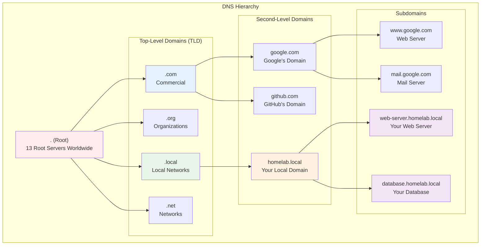

### DNS Protocols and Components

#### Key Protocols
- **UDP Port 53**: Primary protocol for DNS queries (fast, lightweight)
- **TCP Port 53**: Used for large responses or zone transfers
- **DNS over HTTPS (DoH)**: Encrypted DNS queries over HTTPS
- **DNS over TLS (DoT)**: Encrypted DNS queries over TLS

#### DNS Components

| Component | Role | Example |
|-----------|------|---------|
| **DNS Client** | Initiates DNS queries | Your macOS host, web browser |
| **Recursive Resolver** | Performs full DNS lookup on behalf of client | Your ISP's DNS, Google DNS (8.8.8.8) |
| **Root Servers** | Direct queries to appropriate TLD servers | 13 root servers worldwide |
| **TLD Servers** | Handle top-level domains (.com, .org, .local) | Verisign (.com), PIR (.org) |
| **Authoritative Servers** | Provide definitive answers for specific domains | Your dnsmasq server for .lab.local |

### How DNS Resolution Works

When you type `web-server.lab.local` in your browser, here's what happens:

```mermaid
sequenceDiagram
    participant Client as DNS Client<br/>(macOS Host)
    participant Cache as Local DNS Cache
    participant Resolver as Recursive Resolver<br/>(ISP or 8.8.8.8)
    participant Root as Root Server<br/>(.)
    participant TLD as TLD Server<br/>(.local)
    participant Auth as Authoritative Server<br/>(Your dnsmasq)
    
    Note over Client,Auth: DNS Resolution Process
    
    Client->>Cache: 1. Check local cache
    Cache-->>Client: Cache miss
    
    Client->>Resolver: 2. Query: web-server.lab.local?
    
    Resolver->>Root: 3. Query: web-server.lab.local?
    Root->>Resolver: 4. Try .local TLD server at X.X.X.X
    
    Resolver->>TLD: 5. Query: web-server.lab.local?
    TLD->>Resolver: 6. Try authoritative server at 192.168.1.10
    
    Resolver->>Auth: 7. Query: web-server.lab.local?
    Auth->>Resolver: 8. Answer: 192.168.1.101
    
    Resolver->>Client: 9. Final answer: 192.168.1.101
    Client->>Cache: 10. Cache result for future use
    
    Note over Client: Now connect to 192.168.1.101
    
    style Client fill:#f3e5f5
    style Auth fill:#e8f5e8
    style Cache fill:#fff3e0
```

### DNS Resolution Process Breakdown

#### Phase 1: Local Cache Check
```
1. Browser checks its internal DNS cache
2. Operating system checks its DNS cache
3. If found and not expired, use cached IP address
4. If not found, proceed to recursive resolution
```

#### Phase 2: Recursive Resolution
```
5. Query sent to configured DNS resolver (ISP or public DNS)
6. Resolver checks its own cache
7. If not cached, resolver begins iterative queries
```

#### Phase 3: Iterative Queries
```
8. Resolver queries root server: "Where is .local?"
9. Root server responds: "Ask the .local TLD server"
10. Resolver queries .local TLD: "Where is homelab.local?"
11. TLD responds: "Ask the authoritative server at 192.168.1.10"
```

#### Phase 4: Authoritative Response
```
12. Resolver queries your dnsmasq server: "What's web-server.lab.local?"
13. dnsmasq responds: "192.168.1.101"
14. Resolver returns answer to client
15. Client caches result and connects to IP address
```

### DNS Record Types

DNS records are like entries in a database that tell DNS servers how to respond to different types of queries. Think of them as different "types of information" that DNS can store about a domain.

#### Why Do We Need Different Record Types?

**Different services need different information:**
- **Web browsing**: Needs the IP address of a web server
- **Email**: Needs to know which server handles email for a domain
- **Load balancing**: Might need multiple IP addresses for the same service
- **Aliases**: One domain might point to another domain
- **Verification**: Services need to store text-based verification codes

#### Common DNS Record Types Explained

Understanding common DNS record types helps with configuration:

| Record Type | Purpose | Example | When You'd Use It |
|-------------|---------|---------|-------------------|
| **A** | Maps domain to IPv4 address | `web-server.lab.local → 192.168.1.101` | Most common - points domain to server |
| **AAAA** | Maps domain to IPv6 address | `web-server.lab.local → 2001:db8::1` | For IPv6 networks |
| **CNAME** | Creates domain alias | `www.lab.local → web-server.lab.local` | Multiple names for same service |
| **PTR** | Reverse DNS (IP to domain) | `192.168.1.101 → web-server.lab.local` | Security, logging, email validation |
| **MX** | Mail server records | `lab.local → mail.lab.local` | Email routing |
| **TXT** | Text information | `"v=spf1 include:_spf.google.com ~all"` | Service discovery, verification |

#### Real-World Example

When you visit `google.com`, multiple record types work together:

```
google.com.     A       142.250.191.14    (Main website IP)
google.com.     AAAA    2607:f8b0:4004::68 (IPv6 address)
google.com.     MX      10 smtp.google.com (Email server)
www.google.com. CNAME   google.com.        (www alias)
```

#### In Your Lab Setup

Your dnsmasq server will primarily use:
- **A records**: Map container names to IP addresses (`web-server.lab.local → 192.168.1.101`)
- **PTR records**: Enable reverse lookups (optional but useful for logging)
- **CNAME records**: Create service aliases (`web.lab.local → web-server.lab.local`)

### DNS Caching and TTL

**Time To Live (TTL)** determines how long DNS records are cached:

- **Short TTL (60-300 seconds)**: Quick updates, more DNS traffic
- **Long TTL (3600+ seconds)**: Less DNS traffic, slower updates
- **Local domains**: Often use short TTLs for flexibility

### Why Custom DNS for Your Lab?

In your Incus/LXD setup, you're creating a **custom authoritative DNS server** that:

1. **Handles `.lab.local` domain**: Your dnsmasq server is authoritative for this domain
2. **Bypasses public DNS**: No need to query internet DNS for your local services
3. **Provides fast resolution**: Local DNS server responds immediately
4. **Enables automation**: Containers can register themselves automatically
5. **Maintains privacy**: Your internal service names never leave your network

### DNS in Your Infrastructure Context

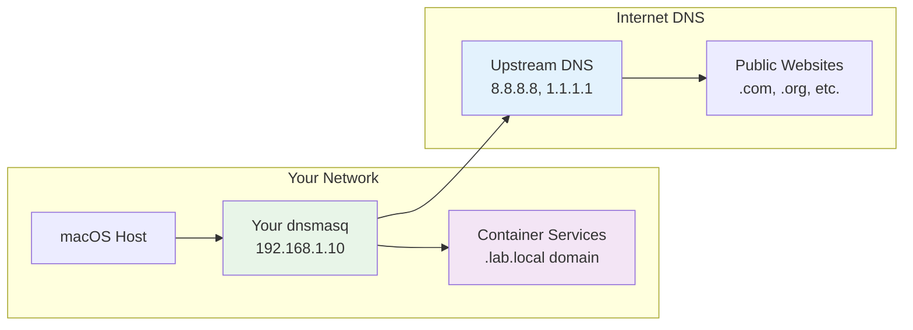

**How your setup works:**
- **Local queries** (*.lab.local) → Handled by your dnsmasq server
- **External queries** (google.com, etc.) → Forwarded to upstream DNS servers
- **Best of both worlds**: Fast local resolution + full internet access

Now that you understand DNS fundamentals, let's implement your custom DNS solution!

---

## Overview

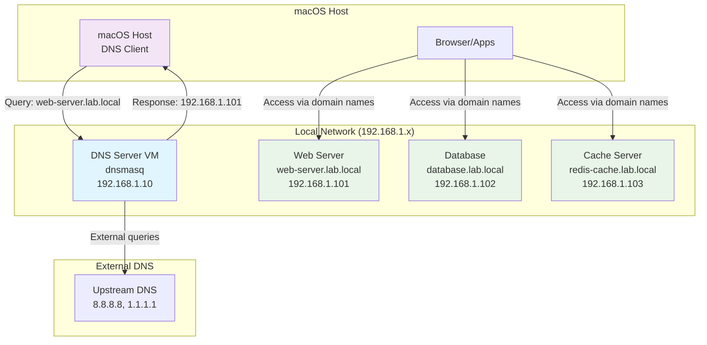

## Architecture Components

### Recommended Approach: dnsmasq + mDNS Hybrid

**Why this approach:**
- ✅ Automatic registration for new containers
- ✅ Lightweight and reliable  
- ✅ Integrates well with macvlan networking
- ✅ Fallback support via mDNS

## DNS Server Options (Ranked)

| Option | Pros | Cons | Best For |
|--------|------|------|----------|
| **dnsmasq** ⭐ | Lightweight, DHCP integration, easy config | Limited advanced features | Home labs, small infrastructure |
| **Pi-hole** | DNS + ad-blocking, web interface | Overkill for DNS-only | Users wanting ad-blocking |
| **BIND9** | Full-featured, enterprise-grade | Complex configuration | Large deployments |

## Implementation Steps

### Step 1: Create DNS Server VM

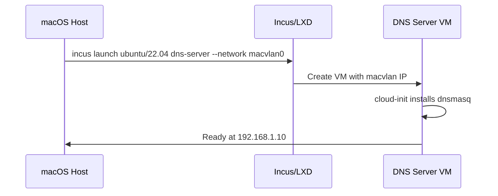

Create the DNS server with cloud-init configuration:

```bash
#!/bin/bash
# File: setup-dns-server.sh

echo "Creating DNS server VM with cloud-init..."

# Create cloud-init configuration for dnsmasq
cat > dnsmasq-cloud-init.yaml << 'EOF'
#cloud-config
package_update: true
package_upgrade: true

packages:
  - dnsmasq
  - curl
  - net-tools

write_files:
  - path: /etc/dnsmasq.conf
    content: |
      # Basic DNS configuration
      port=53
      domain-needed
      bogus-priv
      no-resolv

      # Upstream DNS servers
      server=8.8.8.8
      server=1.1.1.1

      # Local domain configuration
      local=/lab.local/
      domain=lab.local

      # Enable DHCP for auto-registration (optional)
      dhcp-range=192.168.1.100,192.168.1.200,12h
      dhcp-option=option:dns-server,192.168.1.10

      # Static host entries
      address=/dns-server.lab.local/192.168.1.10

      # Enable logging for troubleshooting
      log-queries
      log-dhcp

      # Configuration directory for additional hosts
      conf-dir=/etc/dnsmasq.d/,*.conf
    permissions: '0644'
    owner: root:root

  - path: /etc/dnsmasq.d/containers.conf
    content: |
      # Auto-generated container hosts will be added here
      # This file is managed by update scripts
    permissions: '0644'
    owner: root:root

runcmd:
  - mkdir -p /etc/dnsmasq.d
  - systemctl enable dnsmasq
  - systemctl start dnsmasq
  - systemctl status dnsmasq

final_message: "dnsmasq DNS server is ready!"
EOF

# Create dedicated DNS server VM with cloud-init
incus launch images:ubuntu/22.04 dns-server --network macvlan0 --config=user.user-data="$(cat dnsmasq-cloud-init.yaml)"

# Wait for container to start and cloud-init to complete
echo "Waiting for VM to start and cloud-init to complete..."
sleep 30

# Check cloud-init status
echo "Checking cloud-init status..."
incus exec dns-server -- cloud-init status --wait

# Get the DNS server IP
DNS_IP=$(incus list dns-server --format csv --columns 4 | cut -d' ' -f1)
echo "✅ DNS Server created at IP: $DNS_IP"
echo "✅ dnsmasq service configured and running"
echo "Next: Configure macOS resolver and test DNS resolution"
```

### Step 2: Verify dnsmasq Configuration

The cloud-init configuration automatically:
- Installs dnsmasq
- Creates the main configuration file
- Sets up the containers directory
- Starts and enables the service

Verify the setup:

```bash
# Check if dnsmasq is running
incus exec dns-server -- systemctl status dnsmasq

# Test DNS resolution
incus exec dns-server -- nslookup google.com localhost

# View current configuration
incus exec dns-server -- cat /etc/dnsmasq.conf
```

### Step 3: DNS Registration Automation

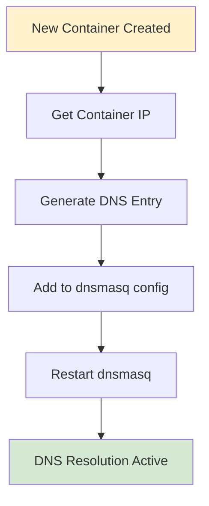

Create the auto-registration script:

```bash
#!/bin/bash
# File: register-container.sh

CONTAINER_NAME=$1
DOMAIN_SUFFIX="lab.local"

if [ -z "$CONTAINER_NAME" ]; then
    echo "Usage: $0 <container-name>"
    echo "Example: $0 web-server"
    exit 1
fi

echo "Registering $CONTAINER_NAME in DNS..."

# Get container IP
CONTAINER_IP=$(incus list $CONTAINER_NAME --format csv --columns 4 | cut -d' ' -f1)

if [ -z "$CONTAINER_IP" ]; then
    echo "❌ Container $CONTAINER_NAME not found or no IP assigned"
    exit 1
fi

# Add DNS entry
incus exec dns-server -- bash -c "echo 'address=/$CONTAINER_NAME.$DOMAIN_SUFFIX/$CONTAINER_IP' >> /etc/dnsmasq.d/containers.conf"

# Restart dnsmasq
incus exec dns-server -- systemctl restart dnsmasq

echo "✅ Registered $CONTAINER_NAME.$DOMAIN_SUFFIX -> $CONTAINER_IP"
echo "Test with: nslookup $CONTAINER_NAME.$DOMAIN_SUFFIX"
```

### Step 4: DNS Naming Scheme

**Recommended naming convention:**

```
# Service-based naming
web-server.lab.local       # Nginx/Apache servers
database.lab.local         # PostgreSQL/MySQL
redis-cache.lab.local      # Redis instances

# Environment-based naming  
app-prod.lab.local         # Production applications
app-dev.lab.local          # Development environment
app-staging.lab.local      # Staging environment

# Function-based naming
nginx-proxy.lab.local      # Reverse proxy
postgres-main.lab.local    # Main database
monitoring.lab.local       # Monitoring stack
```

**Why `.lab.local`:**
- Clear separation from internet domains
- Follows RFC conventions for local use
- Easy to remember and type

### Step 5: Configure macOS Host DNS

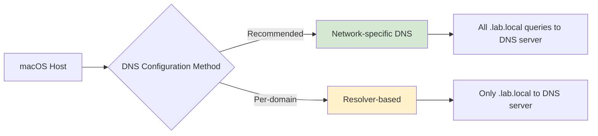

#### Option A: Network-specific DNS (Recommended)

```bash
#!/bin/bash
# File: configure-macos-dns.sh

DNS_SERVER_IP="192.168.1.10"  # Replace with your DNS server IP
NETWORK_SERVICE="Wi-Fi"       # Check with: networksetup -listallnetworkservices

echo "Configuring macOS DNS..."

# Backup current DNS settings
echo "Current DNS servers:"
networksetup -getdnsservers "$NETWORK_SERVICE"

# Add custom DNS server (primary) with fallback
sudo networksetup -setdnsservers "$NETWORK_SERVICE" $DNS_SERVER_IP 8.8.8.8

# Add search domain
sudo networksetup -setsearchdomains "$NETWORK_SERVICE" lab.local

echo "✅ DNS configuration updated!"
echo ""
echo "Verification:"
networksetup -getdnsservers "$NETWORK_SERVICE"
networksetup -getsearchdomains "$NETWORK_SERVICE"
echo ""
echo "Test with: nslookup dns-server.lab.local"
```

#### Option B: Resolver-based (Per-domain)

```bash
# Create resolver directory
sudo mkdir -p /etc/resolver

# Create resolver for .lab.local domain
sudo tee /etc/resolver/lab.local << EOF
nameserver 192.168.1.10
port 53
EOF

echo "✅ Resolver configured for .lab.local domain"
echo "Test with: nslookup dns-server.lab.local"
```

### Step 6: Integration with Container Creation

Enhanced container creation with automatic DNS registration:

```bash
#!/bin/bash
# File: create-container-with-dns.sh

CONTAINER_NAME=$1
IMAGE=${2:-"images:ubuntu/22.04"}

if [ -z "$CONTAINER_NAME" ]; then
    echo "Usage: $0 <container-name> [image]"
    echo "Example: $0 web-server images:nginx/latest"
    exit 1
fi

echo "Creating container: $CONTAINER_NAME"

# Create container with macvlan network
incus launch $IMAGE $CONTAINER_NAME --network macvlan0

# Wait for IP assignment
echo "Waiting for IP assignment..."
sleep 15

# Auto-register DNS
./register-container.sh $CONTAINER_NAME

echo ""
echo "✅ Container $CONTAINER_NAME created and registered!"
echo "🌐 Access via: $CONTAINER_NAME.lab.local"
echo "📋 Manage with: incus exec $CONTAINER_NAME -- bash"
```

### Step 7: Advanced Automation (Optional)

For automatic DNS registration/deregistration on container lifecycle events:

```bash
#!/bin/bash
# File: incus-dns-hook.sh
# Place in /usr/local/bin/incus-dns-hook.sh

EVENT_TYPE=$1
CONTAINER_NAME=$2
DOMAIN_SUFFIX="lab.local"

case $EVENT_TYPE in
    "start")
        echo "Container $CONTAINER_NAME started - registering DNS"
        sleep 5  # Wait for IP assignment
        /path/to/register-container.sh $CONTAINER_NAME
        ;;
    "stop")
        echo "Container $CONTAINER_NAME stopped - removing DNS entry"
        incus exec dns-server -- sed -i "/$CONTAINER_NAME.$DOMAIN_SUFFIX/d" /etc/dnsmasq.d/containers.conf
        incus exec dns-server -- systemctl restart dnsmasq
        ;;
esac
```

## Testing and Verification

### DNS Resolution Test Script

```bash
#!/bin/bash
# File: test-dns.sh

echo "🧪 Testing DNS Resolution..."
echo "================================"

# Test internal resolution
echo "Testing internal domains:"
nslookup dns-server.lab.local
echo ""

# Test if you have other containers
echo "Testing container resolution:"
nslookup web-server.lab.local 2>/dev/null || echo "web-server.lab.local not found (create container first)"
echo ""

# Test external resolution (should still work)
echo "Testing external resolution:"
nslookup google.com
echo ""

# Test reverse lookup
echo "Testing reverse lookup:"
nslookup 192.168.1.10
echo ""

echo "✅ DNS testing complete!"
```

### Troubleshooting Commands

```bash
# Check DNS server status
incus exec dns-server -- systemctl status dnsmasq

# View DNS server logs
incus exec dns-server -- tail -f /var/log/syslog | grep dnsmasq

# List all registered domains
incus exec dns-server -- cat /etc/dnsmasq.d/containers.conf

# Test DNS from within a container
incus exec web-server -- nslookup database.lab.local

# Flush macOS DNS cache
sudo dscacheutil -flushcache
```

## Network Flow Diagram

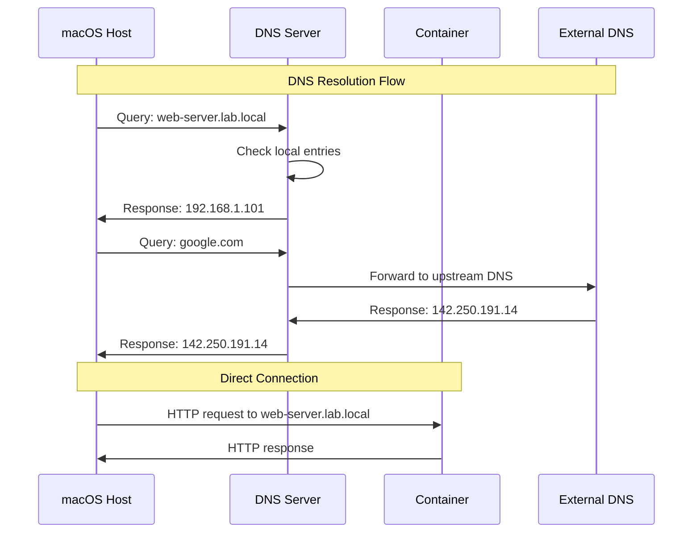

## Summary

This DNS setup provides:

1. **Clean domain names** like `web-server.lab.local` instead of IP addresses
2. **Automatic registration** for new containers
3. **Reliable resolution** with upstream DNS fallback
4. **Easy management** through simple scripts
5. **Integration** with existing macvlan networking

### Quick Start Checklist

- [ ] Create DNS server VM with dnsmasq
- [ ] Configure dnsmasq with `.lab.local` domain
- [ ] Set up macOS to use custom DNS server
- [ ] Create container registration script
- [ ] Test DNS resolution
- [ ] Integrate with container creation workflow

### Next Steps

After implementing this DNS setup, you can:
- Access all services via friendly domain names
- Automatically register new containers
- Set up service discovery for applications
- Implement load balancing with multiple containers

Would you like help implementing any specific part of this DNS infrastructure?

## Architecture Overview

### Option 1: With dnsmasq (Basic Configuration)

## DNS Resolution Flow

### With dnsmasq (Basic Flow)

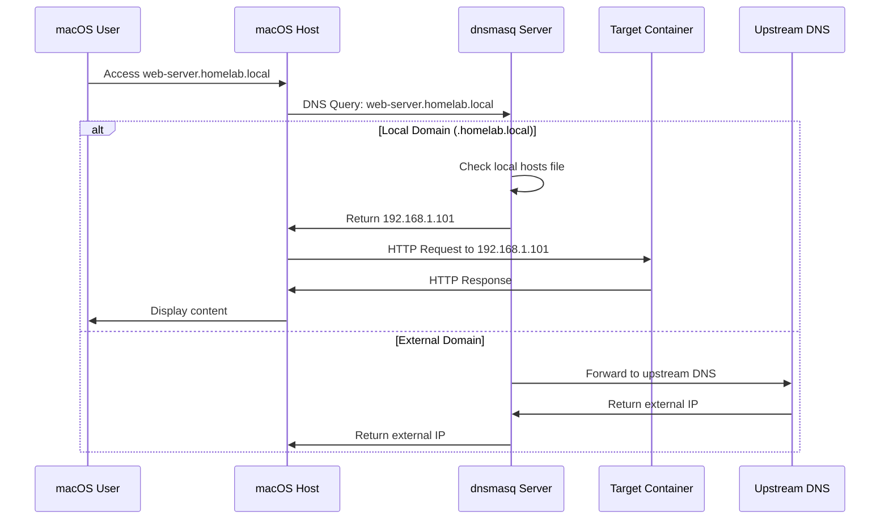

### With Pi-hole (Flow with Filtering)

## Container Lifecycle and DNS Updates

### With dnsmasq (Basic Process)

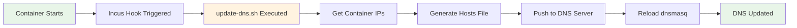

### With Pi-hole (Process with Web Interface)

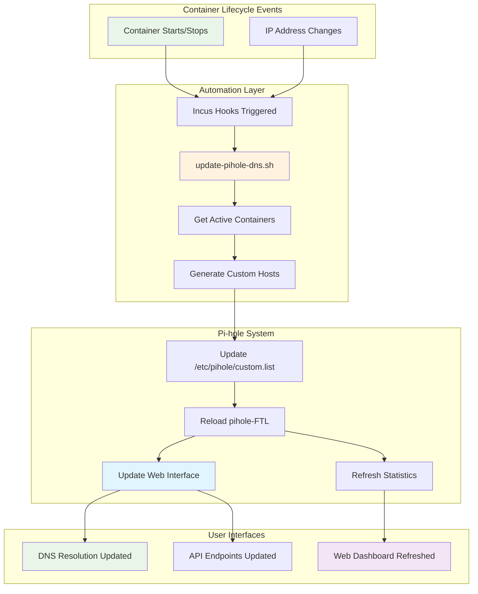

### Architecture Comparison

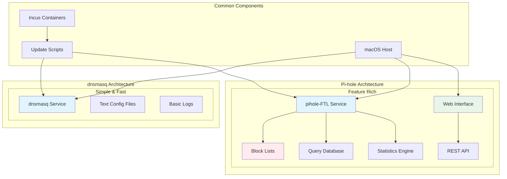

## Alternative: Using Pi-hole Instead of dnsmasq

### Advantages of Pi-hole over Pure dnsmasq:

- **Web Interface**: Visual dashboard for administration
- **Ad Blocking**: Automatic filtering of advertising domains
- **Detailed Statistics**: Query metrics and blocking statistics
- **Block Lists**: Automatic management of malicious domain lists
- **Client Management**: Per-device/IP control
- **REST API**: Advanced automation

### Implementation with Pi-hole

#### Step 1: Install Pi-hole on DNS VM with cloud-init

```bash
#!/bin/bash
# File: setup-pihole-server.sh

echo "Creating Pi-hole DNS server with cloud-init..."

# Create cloud-init configuration for Pi-hole
cat > pihole-cloud-init.yaml << 'EOF'
#cloud-config
package_update: true
package_upgrade: true

packages:
  - curl
  - wget
  - net-tools
  - jq

write_files:
  - path: /etc/pihole/setupVars.conf
    content: |
      PIHOLE_INTERFACE=eth0
      IPV4_ADDRESS=192.168.1.10/24
      IPV6_ADDRESS=
      PIHOLE_DNS_1=8.8.8.8
      PIHOLE_DNS_2=1.1.1.1
      QUERY_LOGGING=true
      INSTALL_WEB_SERVER=true
      INSTALL_WEB_INTERFACE=true
      LIGHTTPD_ENABLED=true
      CACHE_SIZE=10000
      DNS_FQDN_REQUIRED=true
      DNS_BOGUS_PRIV=true
      DNSMASQ_LISTENING=local
      WEBPASSWORD=admin123
      BLOCKING_ENABLED=true
    permissions: '0644'
    owner: root:root
    defer: true

  - path: /etc/dnsmasq.d/02-pihole-local.conf
    content: |
      # Local domain configuration for Pi-hole
      domain=lab.local
      local=/lab.local/
      expand-hosts
      addn-hosts=/etc/pihole/custom.list
    permissions: '0644'
    owner: root:root
    defer: true

  - path: /etc/pihole/custom.list
    content: |
      # Custom local hosts for Pi-hole
      192.168.1.10    dns-server.lab.local
    permissions: '0644'
    owner: root:root
    defer: true

  - path: /tmp/install-pihole.sh
    content: |
      #!/bin/bash
      # Automated Pi-hole installation script
      
      # Create pihole user and directories
      mkdir -p /etc/pihole
      mkdir -p /var/log/pihole
      
      # Download and run Pi-hole installer
      curl -sSL https://install.pi-hole.net | PIHOLE_SKIP_OS_CHECK=true bash /dev/stdin --unattended
      
      # Wait for installation to complete
      sleep 10
      
      # Restart services
      systemctl restart pihole-FTL
      systemctl enable pihole-FTL
      
      # Set web admin password
      pihole -a -p admin123
      
      echo "Pi-hole installation completed!"
    permissions: '0755'
    owner: root:root

runcmd:
  - /tmp/install-pihole.sh
  - sleep 15
  - systemctl status pihole-FTL
  - pihole status

final_message: "Pi-hole DNS server with ad-blocking is ready! Access web interface at http://192.168.1.10/admin"
EOF

# Create dedicated Pi-hole server VM with cloud-init
incus launch images:ubuntu/22.04 dns-server --network macvlan0 --config=user.user-data="$(cat pihole-cloud-init.yaml)"

# Wait for container to start and cloud-init to complete
echo "Waiting for VM to start and Pi-hole installation to complete..."
echo "This may take 3-5 minutes for Pi-hole to fully install..."
sleep 180

# Check cloud-init status
echo "Checking cloud-init status..."
incus exec dns-server -- cloud-init status --wait

# Check Pi-hole status
echo "Checking Pi-hole status..."
incus exec dns-server -- pihole status

# Get the DNS server IP
DNS_IP=$(incus list dns-server --format csv --columns 4 | cut -d' ' -f1)
echo "✅ Pi-hole DNS Server created at IP: $DNS_IP"
echo "✅ Web interface available at: http://$DNS_IP/admin"
echo "✅ Default admin password: admin123"
echo "Next: Configure macOS resolver and test DNS + ad blocking"
```

#### Step 2: Verify Pi-hole Installation

The cloud-init configuration automatically:
- Installs Pi-hole with unattended installation
- Configures local domain support for `.lab.local`
- Sets up custom hosts file
- Enables web interface with default password
- Configures upstream DNS servers

Verify the setup:

```bash
# Check Pi-hole status
incus exec dns-server -- pihole status

# Check web interface accessibility
curl -s http://192.168.1.10/admin/ | grep -q "Pi-hole" && echo "✅ Web interface accessible"

# Test DNS resolution with ad blocking
incus exec dns-server -- nslookup google.com localhost
incus exec dns-server -- nslookup doubleclick.net localhost  # Should be blocked

# View Pi-hole logs
incus exec dns-server -- tail -f /var/log/pihole.log
```

#### Step 3: Configure Local Domains (Already Done by cloud-init)

The cloud-init configuration already created:
- `/etc/dnsmasq.d/02-pihole-local.conf` - Local domain configuration
- `/etc/pihole/custom.list` - Custom hosts file for local services

#### Step 4: Update Script for Pi-hole (Simplified)

```bash
#!/bin/bash
# ~/scripts/update-pihole-dns.sh

DNS_SERVER="dns-server"
CUSTOM_HOSTS="/etc/pihole/custom.list"

update_pihole_records() {
    echo "Updating Pi-hole DNS records..."
    
    # Create temporary file with header
    echo "# Auto-generated Incus/LXD hosts - $(date)" > /tmp/pihole-hosts-new
    echo "192.168.1.10    dns-server.lab.local" >> /tmp/pihole-hosts-new
    
    # Get active instances
    incus list --format csv -c n,4 | while IFS=, read -r name ip; do
        if [[ -n "$ip" && "$ip" != "-" ]]; then
            clean_ip=$(echo "$ip" | sed 's/ (eth0)//')
            echo "$clean_ip    $name.lab.local" >> /tmp/pihole-hosts-new
        fi
    done
    
    # Update Pi-hole
    if [[ -f /tmp/pihole-hosts-new ]]; then
        incus file push /tmp/pihole-hosts-new "$DNS_SERVER$CUSTOM_HOSTS"
        
        # Reload Pi-hole DNS
        incus exec "$DNS_SERVER" -- pihole restartdns reload
        
        rm /tmp/pihole-hosts-new
        echo "✅ Pi-hole DNS records updated successfully"
    fi
}

update_pihole_records
```

### Comparison: dnsmasq vs Pi-hole

| Feature | Pure dnsmasq | Pi-hole |
|---------|-------------|---------|
| **Setup Ease** | ⭐⭐⭐⭐ | ⭐⭐⭐ |
| **Web Interface** | ❌ | ✅ |
| **Ad Blocking** | Manual | ✅ Automatic |
| **Statistics** | Basic Logs | ✅ Complete Dashboard |
| **Remote Management** | SSH Only | ✅ Web + API |
| **System Resources** | Low | Medium |
| **Block Lists** | Manual | ✅ Automatic |
| **Local Configuration** | Config File | ✅ Web UI |

### Final Recommendation

**Use Pi-hole if:**
- You want automatic ad blocking
- You prefer web interface for management
- You need detailed statistics
- You want easy remote management

**Use pure dnsmasq if:**
- You prefer minimalist configuration
- You want maximum performance
- You don't need ad blocking
- You prefer file-based configuration management
